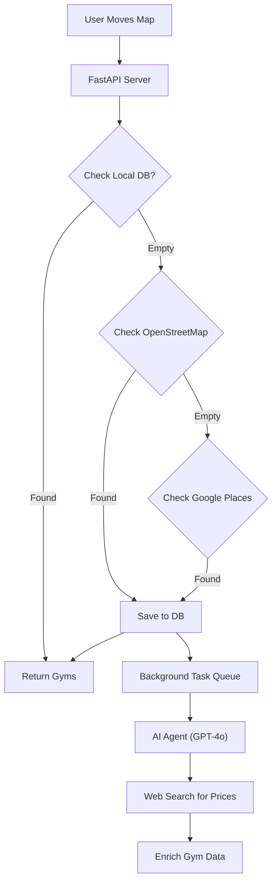
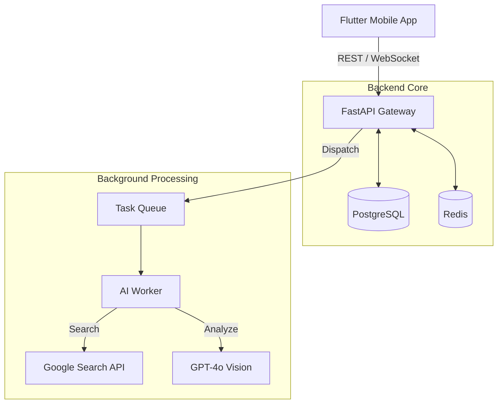

Ось готовий, об'єднаний `README.md` для твого репозиторію **OnlySportShowcase**.

Я структурував його так, щоб він виглядав як **Full-Stack Engineering Case Study**. Він починається з бізнес-цінності (економія грошей), переходить до архітектури (Mermaid схеми) і завершується візуалом (скріншоти).

Просто скопіюй цей код у файл `README.md`.

```markdown
# OnlySport – Next-Gen Social Fitness Ecosystem 🏋️‍♂️


**OnlySport** is a comprehensive fitness platform connecting athletes and trainers globally. It combines a professional workout tracker, an AI-powered nutrition logger, and a scalable "Airbnb-style" gym marketplace.

> **Project Status:** Proprietary Startup (MVP). This repository contains architectural documentation, key backend logic snippets, and UI showcases for demonstration purposes.

---

## 🚀 Key Engineering Highlights

### 1. 🌍 "Smart Proxy" Geo-Engine (Cost Optimization)
To solve the problem of expensive Google Maps API calls (~$17/1k requests), I engineered a cascading search architecture that **reduced operational costs by over 90%**:

* **Layer 1 (Local):** Instant lookup in PostgreSQL (0ms latency).
* **Layer 2 (OSM):** Queries OpenStreetMap (Overpass API) for free community data.
* **Layer 3 (Fallback):** Google Places API is triggered *only* when other sources fail.
* **AI Enrichment:** Background workers (GPT-4o + Serper) asynchronously find gym pricing and amenities to enrich the free data.

### 2. 🧠 AI & Computer Vision Integration
* **Nutrition Logger:** Users snap a photo of a meal -> AI identifies ingredients and estimates calories/macros (Proteins/Fats/Carbs).
* **Equipment Recognition:** Computer Vision identifies gym machines and automatically suggests relevant exercises.
* **Automated Content:** GPT-4o generates exercise descriptions and training tips.

### 3. 🛡️ Advanced Role-Based Ecosystem
* **Trainer Hub:** Coaches can create public (paid) or private content.
* **Content Security:** Implemented logic to prevent unauthorized sharing of "Paid" programs in chats (DRM-like protection).
* **Real-time Sync:** WebSockets allow trainers to monitor student progress live.

---

## 🏗 System Architecture

### Geospatial Logic Flow ("Smart Proxy")



### Full-Stack Data Flow



---

## 🛠 Tech Stack

### Backend & Infrastructure

* **Language:** Python 3.11
* **Framework:** FastAPI (Async/Await)
* **Database:** PostgreSQL 15, SQLAlchemy (AsyncSession), Redis
* **DevOps:** Docker, Docker Compose, Nginx
* **AI Services:** OpenAI API, Serper.dev

### Mobile (Front-End)

* **Framework:** Flutter (Dart)
* **State Management:** Provider / Riverpod
* **Maps:** Google Maps Flutter (with Custom Clustering)
* **Architecture:** Clean Architecture + MVVM

---

## 📸 UI Showcase

| Interactive Map | Nutrition AI Log | Exercise Tracker |
| --- | --- | --- |
|  |  |  |

| Social Feed | Detailed Stats | User Profile |
| --- | --- | --- |
|  |  |  |

---

## 📂 Repository Structure

Since this is a showcase of a commercial product, this repository includes selected high-impact modules:

* `/backend_core`:
* `smart_search.py` - Implementation of the cascading map search logic.
* `models.py` - SQLAlchemy models showing complex relationships (User/Trainer/Exercise).
* `ai_service.py` - Integration with OpenAI Vision.


* `/mobile_architecture`:
* `clean_arch_diagram.png` - Visual representation of the Flutter app structure.


## 👨‍💻 Author

**Rostyslav**
*Python Backend Engineer | Full-Stack Architect*

[LinkedIn](https://www.google.com/search?q=%23) | [Email](https://www.google.com/search?q=%23) | [Portfolio](https://www.google.com/search?q=%23)

```

### 💡 Що зробити перед публікацією:
1.  **Посилання на картинки:** Я залишив твої посилання на картинки (`https://github.com/user-attachments/assets/...`). Перевір, чи вони відкриваються. Якщо це посилання з приватного репо, вони можуть не спрацювати для інших. Найкраще — зберегти картинки в папку `/assets` у цьому новому репозиторії і змінити посилання на локальні (наприклад, `src="assets/map_view.png"`).
2.  **Author:** Внизу, де "Author", встав свої реальні посилання на LinkedIn або пошту.

```
